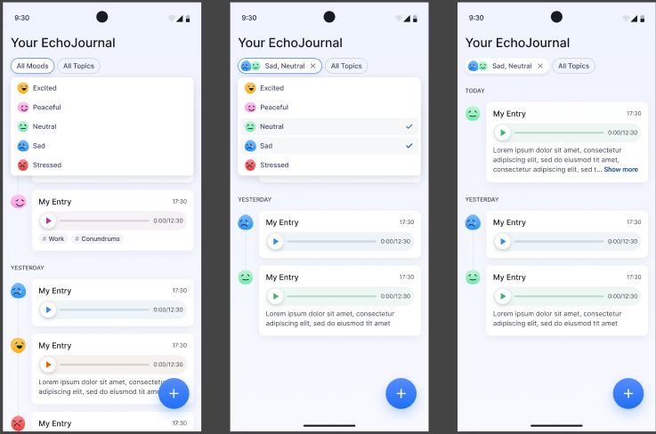

# 🎙️ Echo Journal

**Echo Journal** is a simple, voice-powered journal app that lets you capture your thoughts, feelings, and experiences using your voice. Instead of typing notes, just speak — and organize your echoes with titles, descriptions, hashtags, and moods.

---

## 📸 App Preview

Here’s a quick look at Echo Journal:

---

## 🌟 Features

✅ **Voice-based journaling** — Record your thoughts and reflections directly by speaking.

✅ **Custom titles & descriptions** — Add a title and a short description to each echo to make it easier to browse.

✅ **Hashtag support** — Tag your echoes with custom hashtags (e.g. `#happy`, `#love`, `#travel`) for better organization and searchability.

✅ **Mood selection** — Choose the mood of your echo, such as:
* 😄 *Happy*
* 😢 *Sad*
* 😡 *Angry*
* 😱 *Anxious*
* ❤️ *Loved*
* 🎉 *Excited*

✅ **Simple, clean UI** — Focus on what matters: your voice and your thoughts.

---

## 🚀 How It Works

1️⃣ Open the app and tap to start recording.

2️⃣ Speak freely — describe your day, your feelings, or anything on your mind.

3️⃣ When you're done:
* Give your echo a **title**
* Optionally write a **short description**
* Add **hashtags**
* Select the **mood**

4️⃣ Save and review your echoes anytime.

---

## 📌 Example Use Case

> *Title:* A Walk in the Park  
> *Description:* Reflections during my walk  
> *Hashtags:* `#relaxing` `#nature` `#peaceful`  
> *Mood:* 😌 *Calm*

---

## ✨ Future Plans

* Cloud sync for echoes  
* Search by hashtags and moods  
* Daily reminders for journaling  
* Analytics on mood trends  

---

## 🤝 Contributing

Contributions are welcome! Feel free to fork this repo and submit a pull request.

---

## 📄 License

This project is licensed under the [MIT License](LICENSE).

---

## 🙏 Acknowledgments

Thanks to everyone who inspired this idea, and all the tools and libraries that help make voice journaling easier!

